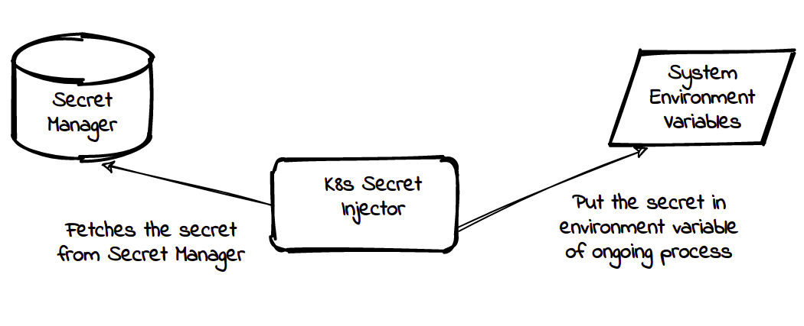

<div align="left">
    
</div>

## K8s Secret Injector

k8s-secret-injector is a tool that can connect with multiple secret managers to fetch the secrets and then inject them into the environment variable in a secure way. The motive is to create this injector is to use it with another project of our k8s-vault-webhook but this can be used independently outside Kubernetes as well.

The secret managers which are currently supported:-

- **[Hashicorp Vault](https://www.vaultproject.io/)**
- **[AWS Secret Manager](https://aws.amazon.com/secrets-manager/)**

There are some secret managers which are planned to be implemented in future.

- **[Azure Key Vault](https://azure.microsoft.com/en-in/services/key-vault/)**
- **[GCP Secret Manager](https://cloud.google.com/secret-manager)**

### Supported Features

- k8s-secret-injector can connect with Vault using Kubernetes as backend
- Authenticate with Kubernetes using Serviceaccount mechanism
- Support AWS Secret Manager as secret manager backend
- Inject secrets directly to the process, i.e. after the injection you cannot read secrets from the environment variable
- Inject secret to pod's application process from AWS Secret Manager

### Architecture

<div align="center">
    
</div>

### Installation

We can simply clone the repo and compile the binary according to the OS architecture and environment.

```shell
make build-code
```

In any case, if you don't want to compile the code. The binary can be installed by downloading from [Releases](https://gitlab.com/ot-container-kit/kubernetes/ot-kubernetes/k8s-secret-injector/-/releases) as well.

### Usage

For using the k8s-secret-injector, simple `--help` flag can list out all the available options. For example:-

```shell
$ k8s-secret-injector --help
K8s Secret Injector Version: 1.0

A tool which can connect with multiple secret manager and inject them in environment variable

Usage:
  k8s-secret-injector [command]

Available Commands:
  aws         Fetch secrets from AWS Secret Manager
  help        Help about any command
  vault       Fetch and inject secrets from Vault to a given command
  version     Print the version of k8s secret injector

Flags:
      --config string      config file (default is $HOME/.k8s-injector.yaml)
  -h, --help               help for k8s-secret-injector
  -t, --toggle             Help message for toggle
  -v, --verbosity string   Log level (debug, info, warn, error, fatal, panic (default "info")

Use "k8s-secret-injector [command] --help" for more information about a command.
```


### Development

If you like to contribute to this project, you are more than welcome. Please see our [DEVELOPMENT.md](./DEVELOPMENT.md) for details.

### Release History

Please see our [CHNANGELOG.md](./CHNANGELOG.md) for details.

### Contact

If you have any suggestion or query. Contact us at

[opensource@opstree.com](mailto:opensource@opstree.com)
